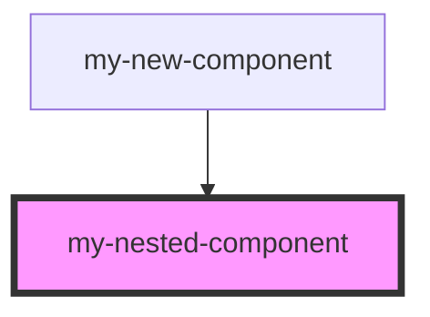

# my-nested-component

<!-- Auto Generated Below -->

## Dependencies

### Used by

 - [my-new-component](../my-new-component)

### Graph

----------------------------------------------

*Built with [StencilJS](https://stenciljs.com/)*
